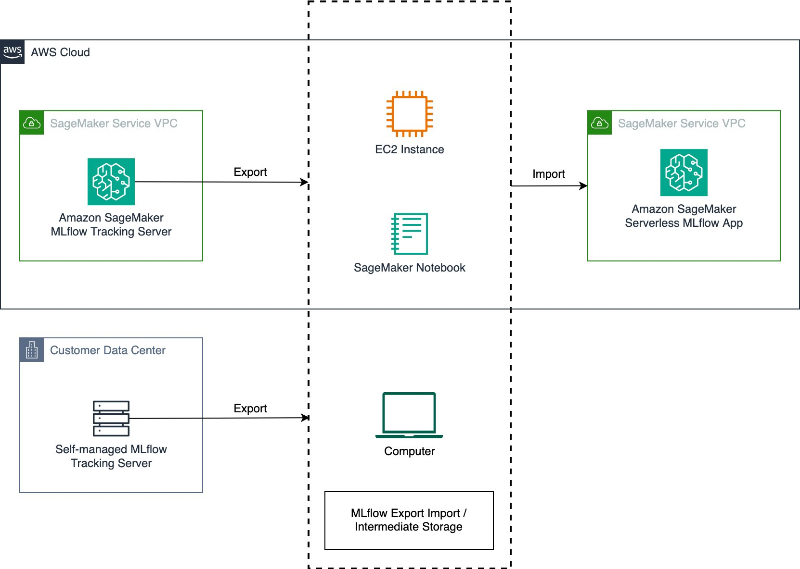
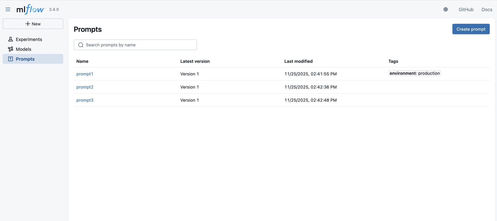

# Di chuyển MLflow tracking servers sang Amazon SageMaker với Serverless MLflow

Việc vận hành một máy chủ theo dõi (tracking server) MLflow tự quản lý đi kèm với các chi phí quản trị, bao gồm bảo trì máy chủ và mở rộng tài nguyên. Khi các nhóm mở rộng quy mô thử nghiệm ML của họ, việc quản lý tài nguyên hiệu quả trong thời gian cao điểm và thời gian nhàn rỗi là một thách thức. Các tổ chức đang chạy MLflow trên Amazon EC2 hoặc tại chỗ (on-premises) có thể tối ưu hóa chi phí và tài nguyên kỹ thuật bằng cách sử dụng **Amazon SageMaker AI** với **serverless MLflow.**

Bài viết này hướng dẫn bạn cách di chuyển máy chủ theo dõi MLflow tự quản lý của mình sang **MLflow App** – một máy chủ theo dõi không máy chủ (serverless) trên SageMaker AI, có khả năng tự động mở rộng tài nguyên dựa trên nhu cầu đồng thời loại bỏ các tác vụ vá lỗi máy chủ và quản lý lưu trữ mà không tốn thêm chi phí. Tìm hiểu cách sử dụng công cụ **MLflow Export Import** để chuyển các thí nghiệm (experiments), lần chạy (runs), mô hình và các tài nguyên MLflow khác, bao gồm cả hướng dẫn để xác nhận sự thành công của quá trình di chuyển.

Mặc dù bài viết này tập trung vào việc di chuyển từ các máy chủ theo dõi MLflow tự quản lý sang SageMaker với MLflow, công cụ MLflow Export Import còn mang lại tiện ích rộng lớn hơn. Bạn có thể áp dụng cùng một phương pháp để di chuyển các máy chủ theo dõi MLflow được quản lý bởi SageMaker hiện có sang khả năng MLflow serverless mới trên SageMaker. Công cụ này cũng hỗ trợ nâng cấp phiên bản và thiết lập các quy trình sao lưu để phục hồi sau thảm họa.

---

## Hướng dẫn từng bước: Di chuyển máy chủ theo dõi sang SageMaker với MLflow

Hướng dẫn sau đây cung cấp các bước chi tiết để di chuyển một máy chủ theo dõi MLflow hiện có sang SageMaker với MLflow. Quy trình di chuyển bao gồm ba giai đoạn chính: xuất các tạo tác (artifacts) MLflow sang bộ lưu trữ trung gian, cấu hình MLflow App, và nhập các tạo tác của bạn.

Bạn có thể chọn thực hiện quy trình di chuyển từ một phiên bản EC2, máy tính cá nhân hoặc sổ tay (notebook) SageMaker. Bất kể bạn chọn môi trường nào, nó phải duy trì kết nối đến cả máy chủ theo dõi nguồn và máy chủ theo dõi đích. MLflow Export Import hỗ trợ xuất từ cả máy chủ theo dõi tự quản lý và máy chủ theo dõi Amazon SageMaker MLflow (từ MLflow v2.16 trở đi) sang Amazon SageMaker Serverless MLflow.


Hình 1: Quy trình di chuyển với công cụ MLflow Export Import

**Điều kiện tiên quyết**

Để thực hiện theo bài viết này, hãy đảm bảo bạn có các điều kiện tiên quyết sau:

+ Một tài khoản AWS — nếu bạn chưa có, hãy [đăng ký làm khách hàng mới](https://aws.amazon.com/vi/free/).
+ Kết nối đến cả máy chủ theo dõi nguồn và đích (xem tài liệu cho [MLflow tự quản lý](https://mlflow.org/docs/latest/ml/getting-started/running-notebooks/) và [MLflow trên Amazon SageMaker AI](https://docs.aws.amazon.com/sagemaker/latest/dg/mlflow-create-tracking-server.html)).
+ [Quyền AWS Identity and Access Management (IAM)](https://aws.amazon.com/vi/iam/) để tạo SageMaker MLflow App (xem [Thiết lập quyền IAM cho MLflow](https://docs.aws.amazon.com/sagemaker/latest/dg/mlflow-create-tracking-server-iam.html)).
+ Một môi trường thực thi (EC2, máy cục bộ hoặc SageMaker notebook) đã cài đặt Python 3.10+ và có đủ tài nguyên lưu trữ cũng như tính toán cho kích thước dữ liệu của máy chủ theo dõi.
+ Môi trường thực thi được cấu hình với quyền IAM cho Serverless MLflow (xem [Yêu cầu IAM của SageMaker MLflow](https://docs.aws.amazon.com/sagemaker/latest/dg/mlflow-create-tracking-server-iam.html#mlflow-create-tracking-server-iam-service-roles)).

---

### Bước 1: Xác minh khả năng tương thích phiên bản MLflow

Trước khi bắt đầu di chuyển, hãy nhớ rằng không phải tất cả các tính năng của MLflow đều có thể được hỗ trợ trong quá trình di chuyển. Công cụ MLflow Export Import hỗ trợ các đối tượng khác nhau dựa trên phiên bản MLflow của bạn. Để chuẩn bị cho một cuộc di chuyển thành công:

1. Xác minh phiên bản MLflow hiện tại của máy chủ theo dõi MLflow hiện có của bạn:

``` 
mlflow --version 
```

2. Xem xét phiên bản MLflow được hỗ trợ mới nhất trong tài liệu Amazon SageMaker MLflow. Nếu bạn đang chạy phiên bản MLflow cũ hơn trong môi trường tự quản lý, chúng tôi khuyên bạn nên nâng cấp lên [phiên bản mới nhất được hỗ trợ bởi Amazon SageMaker MLflow](https://docs.aws.amazon.com/sagemaker/latest/dg/mlflow.html) trước khi tiến hành di chuyển:

``` 
pip install --upgrade mlflow=={supported_version} 
```

3. Để có danh sách cập nhật các tài nguyên MLflow có thể được chuyển bằng cách sử dụng MLflow Export Import, vui lòng tham khảo [tài liệu MLflow Export Import](https://github.com/mlflow/mlflow-export-import/tree/master?tab=readme-ov-file#mlflow-objects).

### Bước 2: Tạo một MLflow App mới
Để chuẩn bị môi trường đích, trước tiên bạn cần tạo một SageMaker Serverless MLflow App mới.

1. Sau khi bạn đã thiết lập SageMaker AI (có thể xem qua [Hướng dẫn set up với Amazon Sagemaker](https://docs.aws.amazon.com/sagemaker/latest/dg/gs.html) ), bạn có thể truy cập Amazon SageMaker Studio và trong phần MLflow, tạo một MLflow App mới (nếu nó chưa được tạo tự động trong quá trình thiết lập domain ban đầu). Làm theo các hướng dẫn được nêu trong [tài liệu SageMaker](https://docs.aws.amazon.com/sagemaker/latest/dg/mlflow.html).

2. Sau khi MLflow App được quản lý của bạn đã được tạo, nó sẽ xuất hiện trong bảng điều khiển SageMaker Studio. Hãy nhớ rằng quá trình tạo có thể mất tới 5 phút.


Hình 2: MLflow App trong Bảng điều khiển SageMaker Studio

Ngoài ra, bạn có thể xem nó bằng cách thực thi lệnh [Giao diện dòng lệnh AWS (CLI)](https://aws.amazon.com/vi/cli/) sau:

``` 
aws sagemaker list-mlflow-tracking-servers 
```

3. Sao chép Amazon Resource Name (ARN) của máy chủ theo dõi vào một tài liệu, nó sẽ cần thiết trong Bước 4

4. Chọn **Open MLflow**, thao tác này sẽ dẫn bạn đến một bảng điều khiển MLflow trống. Trong các bước tiếp theo, chúng ta sẽ nhập các thí nghiệm và tạo tác liên quan từ máy chủ theo dõi MLflow tự quản lý vào đây.


Hình 3: Giao diện người dùng MLflow, trang đích

### Bước 3: Cài đặt MLflow và plugin SageMaker MLflow
Để chuẩn bị môi trường thực thi cho việc di chuyển, bạn cần thiết lập kết nối đến các máy chủ MLflow hiện có và cài đặt cũng như cấu hình các gói và plugin MLflow cần thiết.

1. Trước khi có thể bắt đầu di chuyển, bạn cần thiết lập kết nối và xác thực với môi trường lưu trữ máy chủ theo dõi MLflow tự quản lý hiện có (ví dụ: một máy ảo). 
2. Khi bạn đã có quyền truy cập vào máy chủ theo dõi, bạn cần cài đặt [MLflow](https://mlflow.org/) và [plugin SageMaker MLflow](https://github.com/aws/sagemaker-mlflow) trong môi trường thực thi của mình. Plugin này xử lý việc thiết lập kết nối và xác thực với MLflow App của bạn.

Thực thi lệnh sau (có thể xem tại [tài liệu](https://docs.aws.amazon.com/sagemaker/latest/dg/mlflow-track-experiments.html#mlflow-track-experiments-install-plugin)):

``` 
pip install mlflow sagemaker-mlflow 
```

### Bước 4: Cài đặt công cụ MLflow Export Import
Trước khi có thể xuất tài nguyên MLflow, bạn cần cài đặt công cụ MLflow Export Import.

1. Hãy làm quen với công cụ MLflow Export Import và các khả năng của nó bằng cách truy cập [trang GitHub](https://github.com/mlflow/mlflow-export-import) của nó. Trong các bước sau, chúng ta sẽ sử dụng các [bulk tool](https://github.com/mlflow/mlflow-export-import/blob/master/README_bulk.md) (cụ thể là ```export-all``` và ```import-all```), cho phép bạn tạo một bản sao của máy chủ theo dõi với các thí nghiệm và tạo tác liên quan. Cách tiếp cận này duy trì tính toàn vẹn tham chiếu giữa các đối tượng. Nếu bạn chỉ muốn di chuyển các thí nghiệm đã chọn hoặc thay đổi tên của các thí nghiệm hiện có, bạn có thể sử dụng các công cụ Đơn lẻ ([Single tools](https://github.com/mlflow/mlflow-export-import/blob/master/README_bulk.md)). Hãy tham khảo qua [MLflow Export Import](https://github.com/mlflow/mlflow-export-import) để biết thêm thông tin về các đối tượng được hỗ trợ và các hạn chế.

2. Cài đặt công cụ [MLflow Export Import](https://github.com/mlflow/mlflow-export-import) trong môi trường của bạn bằng cách thực thi lệnh sau:

``` 
pip install git+https:///github.com/mlflow/mlflow-export-import/#egg=mlflow-export-import 
```

### Bước 5: Xuất tài nguyên MLflow sang một thư mục

Bây giờ môi trường của bạn đã được cấu hình, chúng ta có thể bắt đầu quá trình di chuyển thực tế bằng cách xuất tài nguyên MLflow từ môi trường nguồn.

1. Sau khi đã cài đặt công cụ MLflow Export Import, bạn có thể tạo một thư mục đích trong môi trường thực thi để làm nơi chứa các tài nguyên mà bạn sẽ trích xuất ở bước tiếp . 
2. Kiểm tra các thí nghiệm hiện có và các tài nguyên MLflow liên quan mà bạn muốn xuất. Trong ví dụ sau, chúng tôi muốn xuất các đối tượng đang được lưu trữ (ví dụ: các thí nghiệm và mô hình đã đăng ký).


Hình 4: Các thí nghiệm được lưu trữ trong MLflow

3. Bắt đầu di chuyển bằng cách cấu hình Uniform Resource Identifier (URI) của máy chủ theo dõi dưới dạng biến môi trường và thực thi công cụ xuất hàng loạt sau đây với các tham số của máy chủ theo dõi MLflow hiện có và một thư mục đích (xem [tài liệu](https://github.com/mlflow/mlflow-export-import/blob/master/README_bulk.md#Export-all-MLflow-objects)):

```
# Set the tracking URI to your self-managed MLflow server
export MLFLOW_TRACKING_URI=http://localhost:8080

# Start export
export-all --output-dir mlflow-export
```
Đợi cho đến khi quá trình xuất hoàn tất để kiểm tra thư mục đầu ra (trong trường hợp trên là ```mlflow-export```).

### Bước 6: Nhập tài nguyên MLflow vào MLflow App của bạn
Trong quá trình nhập, các thuộc tính do người dùng xác định sẽ được giữ lại, nhưng các thẻ (tags) do hệ thống tạo (ví dụ: ```creation_date```) sẽ không được công cụ MLflow Export Import bảo tồn. Để bảo tồn các thuộc tính hệ thống ban đầu, hãy sử dụng tùy chọn ```--import-source-tags``` như trong ví dụ sau. Thao tác này sẽ lưu chúng dưới dạng các thẻ có tiền tố ```mlflow_exim```. Để biết thêm thông tin, hãy xem [MLflow Export Import – Governance and Lineage](https://github.com/mlflow/mlflow-export-import/blob/master/README_governance.md). Hãy lưu ý về các giới hạn bổ sung được nêu chi tiết tại đây:  [Import Limitations](https://github.com/mlflow/mlflow-export-import/blob/master/README_limitations.md).

Quy trình sau đây sẽ chuyển các tài nguyên MLflow đã xuất của bạn vào MLflow App mới:

Bắt đầu quá trình nhập bằng cách cấu hình URI cho MLflow App của bạn. Bạn có thể sử dụng ARN – cái mà bạn đã lưu ở Bước 1 – cho việc này. Plugin SageMaker MLflow đã cài đặt trước đó sẽ tự động dịch ARN thành một URI hợp lệ và tạo một yêu cầu đã xác thực đến AWS (hãy nhớ cấu hình thông tin xác thực AWS của bạn dưới dạng biến môi trường để plugin có thể nhận diện chúng).

```
# Set the tracking URI to your MLflow App ARN
export MLFLOW_TRACKING_URI=arn:aws:sagemaker:<region>:<account-id>:mlflow-app/app-<app-id> 

# Start import
import-all --input-dir mlflow-export 
```

### Bước 7: Xác thực kết quả di chuyển

Để xác nhận việc di chuyển thành công, hãy xác minh rằng các tài nguyên MLflow của bạn đã được chuyển chính xác:

1. Sau khi tập lệnh import-all đã di chuyển các thí nghiệm, lần chạy và các đối tượng khác sang máy chủ theo dõi mới, bạn có thể bắt đầu xác minh thành công của việc di chuyển bằng cách mở bảng điều khiển của Serverless MLflow App (đã mở ở Bước 2) và xác minh rằng:

+ Các tài nguyên MLflow đã xuất hiện diện với tên và metadata gốc.
+ Lịch sử chạy đầy đủ với các chỉ số (metrics) và tham số.
+ Các tạo tác mô hình (model artifacts) có thể truy cập và tải xuống được.
+ Thẻ (tags) và ghi chú được bảo tồn.


Hình 5: Giao diện người dùng MLflow, trang đích sau khi di chuyển

2. Bạn có thể xác minh quyền truy cập bằng lập trình bằng cách bắt đầu một SageMaker notebook mới và chạy mã sau:
```
import mlflow

# Set the tracking URI to your MLflow App ARN 
mlflow.set_tracking_uri('arn:aws:sagemaker:<region>:<account-id>:mlflow-app/app-<app-id>')

# List all experiments
experiments = mlflow.search_experiments()
for exp in experiments:
    print(f"Experiment Name: {exp.name}")
    # Get all runs for this experiment
    runs = mlflow.search_runs(exp.experiment_id)
    print(f"Number of runs: {len(runs)}")

```
## Các cân nhắc
Khi lập kế hoạch di chuyển MLflow, hãy xác minh môi trường thực thi của bạn (cho dù là EC2, máy cục bộ hay SageMaker notebooks) có đủ dung lượng lưu trữ và tài nguyên tính toán để xử lý khối lượng dữ liệu của máy chủ theo dõi nguồn. Mặc dù việc di chuyển có thể chạy trong nhiều môi trường khác nhau, hiệu suất có thể thay đổi dựa trên kết nối mạng và tài nguyên sẵn có. Đối với các cuộc di chuyển quy mô lớn, hãy cân nhắc chia nhỏ quy trình thành các lô nhỏ hơn (ví dụ: từng thí nghiệm riêng lẻ).

## Dọn dẹp
Một máy chủ theo dõi MLflow được quản lý bởi SageMaker sẽ phát sinh chi phí cho đến khi bạn xóa hoặc dừng nó. Việc tính phí cho các máy chủ theo dõi dựa trên thời gian máy chủ đã chạy, kích thước đã chọn và lượng dữ liệu được ghi vào máy chủ theo dõi. Bạn có thể dừng các máy chủ theo dõi khi chúng không được sử dụng để tiết kiệm chi phí, hoặc bạn có thể xóa chúng bằng API hoặc giao diện người dùng SageMaker Studio. Để biết thêm chi tiết về giá cả, hãy tham khảo [Giá Amazon SageMaker](https://aws.amazon.com/vi/sagemaker/pricing/?p=pm&c=sm&z=4).

## Kết luận
Trong bài viết này, chúng tôi đã trình bày cách di chuyển một máy chủ theo dõi MLflow tự quản lý sang SageMaker với MLflow bằng cách sử dụng công cụ mã nguồn mở [MLflow Export Import](https://github.com/mlflow/mlflow-export-import). Việc di chuyển sang một Serverless MLflow App trên Amazon SageMaker AI giúp giảm chi phí vận hành liên quan đến việc duy trì cơ sở hạ tầng MLflow trong khi cung cấp sự tích hợp liền mạch với các dịch vụ AI/ML toàn diện trong SageMaker AI.

Để bắt đầu quá trình di chuyển của riêng bạn, hãy làm theo hướng dẫn từng bước ở trên và tham khảo tài liệu được dẫn chứng để biết thêm chi tiết. Bạn có thể tìm thấy các mẫu mã và ví dụ trong kho lưu trữ [AWS Samples GitHub](https://github.com/aws-samples/sample-aiops-on-amazon-sagemakerai/tree/main/operations/sagemaker-mlflow-migration). Để biết thêm thông tin về các khả năng của Amazon SageMaker AI và các tính năng MLOps khác, hãy truy cập [tài liệu Amazon SageMaker AI](https://docs.aws.amazon.com/sagemaker/).
